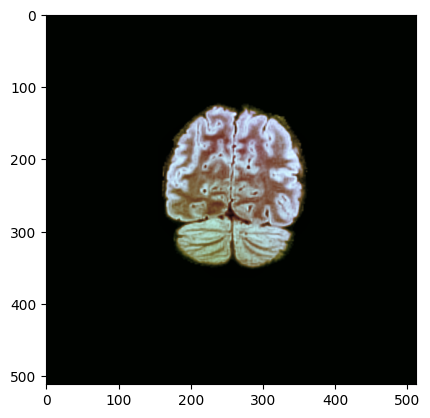

## RSNA-MICCAI Brain Tumor Radiogenomic Classification

Team rähmä.ai solution for [RSNA-MICCAI Brain Tumor Radiogenomic Classification](https://www.kaggle.com/c/rsna-miccai-brain-tumor-radiogenomic-classification)

Predict the status of a genetic biomarker important for brain cancer treatment.

----------------------------------

#### Folder structure
```
root
|_input
|  |_rsna-miccai-brain-tumor-radiogenomic-classification
|    |_...
|
|media
|  |_...
|_notebooks
|  |_...
|_src
|  |_...
|
|_...
```

##### Notebook descriptions

1. [Convert_dicoms_to_rgb](./notebooks/Convert_dicoms_to_rgb.ipynb) Convert original Dicom files to RGB-PNG images. Channels are R: min-max normalized, G: CLAHE, B: histogram equalized.

2. [cv-splits](./notebooks/cv-splits.ipynb) Split all train cohort BraTS21IDs into five folds stratified by MGMT_value.

## Environment setup and package installation

- Python 3.8
- Anaconda

Preferable way of setting up the development environment is with `conda`
```sh
conda create -n brainclf python=3.8 jupyter pip
conda activate brainclf
```

Install pytorch
```sh
conda install pytorch torchvision torchaudio cudatoolkit=11.0 -c pytorch
```

Install GDCM for reading some of the dicom formats
```sh
conda install -c conda-forge gdcm -y
```

Install python packages
```sh
pip install -r requirements.txt
```

## Reading dicoms

```
from src.dicom_utils import get_uint8_rgb

dicom_path = "./input/rsna-miccai-brain-tumor-radiogenomic-classification/train/00000/FLAIR/Image-50.dcm"
rgb_array = get_uint8_rgb(dicom_path)
```

