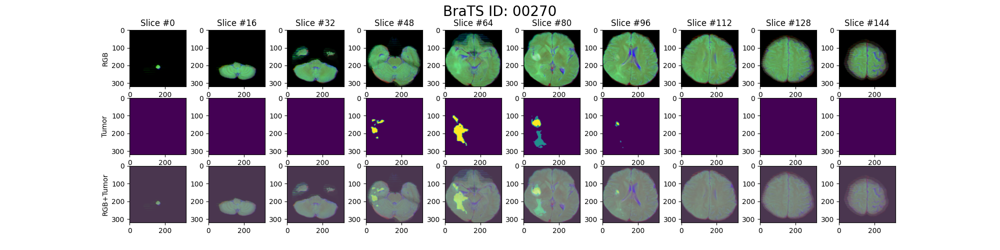

## RSNA-MICCAI Brain Tumor Radiogenomic Classification

Team rähmä.ai solution for [RSNA-MICCAI Brain Tumor Radiogenomic Classification](https://www.kaggle.com/c/rsna-miccai-brain-tumor-radiogenomic-classification)

Predict the status of a genetic biomarker important for brain cancer treatment.

----------------------------------

## Registering process


#### Folder structure
```
root
|_input
|  |_rsna-miccai-brain-tumor-radiogenomic-classification
|    |_...
|
|media
|  |_...
|_notebooks
|  |_...
|_src
|  |_...
|
|_...
```

##### Notebook descriptions

1. ~~[convert_dicoms_to_rgb](./notebooks/1-convert_dicoms_to_rgb.ipynb) Convert original Dicom files to RGB-PNG images. Channels are R: min-max normalized, G: CLAHE, B: histogram equalized.~~

Note. There is a better way to preprocess data. See notebook [Case registration](./notebooks/3-case-registration.ipynb).

2. [cv-splits](./notebooks/2-cv-splits.ipynb) Split all train cohort BraTS21IDs into five folds stratified by MGMT_value.

3. [Case registration](./notebooks/3-case-registration.ipynb). Registers all MRI modalities to axial plane and saves patient cases as 100x256x256x3 (z,x,y,c) `BraTSID.npy` arrays (R:t1w, G:T1ce, B:T2). Additionally, registers [Task-1](https://www.synapse.org/#!Synapse:syn25829067/wiki/610863) segmentation masks to case and saves them as `BraTSID_seg.npy` 100x256x256 (z,x,y) arrays. This requires accepting Task-1 terms and downloading & extracting [this](https://www.kaggle.com/dschettler8845/load-task-1-dataset-comparison-w-task-2-dataset/data) set that @dschettler8845 uploaded. Here is a sample visualization of a registered case with tumor segmentation map.



4. [Registered DS sanity check](./notebooks/4-registered-ds-sanity-check.ipynb) Show how to open registered case files and check that everything looks right visually. Saves [tumor map videos](./media/registered-tumor-map.mp4) for visualization.

## Environment setup and package installation

- Python 3.8
- Anaconda

Preferable way of setting up the development environment is with `conda`
```sh
conda create -n brainclf python=3.8 jupyter pip
conda activate brainclf
```

Install pytorch
```sh
conda install pytorch torchvision torchaudio cudatoolkit=11.0 -c pytorch
```

Install GDCM for reading some of the dicom formats
```sh
conda install -c conda-forge gdcm -y
```

Install python packages
```sh
pip install -r requirements.txt
```

## Reading and registering new cases
Check notebook #3 if you want to also get registered tumor segmentation annotations. For inferencing new cases, only `rgb_cube_arr` is required.

```
from src.registering import Registered_BraTS_Case

dicom_dir = "./input/rsna-miccai-brain-tumor-radiogenomic-classification/test/"
resize_to=[256,256,100]
reg = Registered_BraTS_Case(dicom_dir, resize_to)

brat_id_str = "00709"

rgb_cube_arr = reg.get_registered_case(brat_id_str)
print(rgb_cube_arr.shape)
```
Prints:
`(100,256,256,3)`

## Training segmentation model

Before training, create a `wandb_params.json` file in root folder with wandb profile name.

Example file:
```
{
    "entity": "your_profile_name",
    "project": "raehmae-miccai-brainclf"
}
```

Train 5 fold models and one model with all training data:

`sh train_seg_folds.sh`

## Training segmentation model

Before training, configure `wandb_params.json` file.

Train 5 fold models and one model with all training data:

`sh train_clf_folds.sh`


