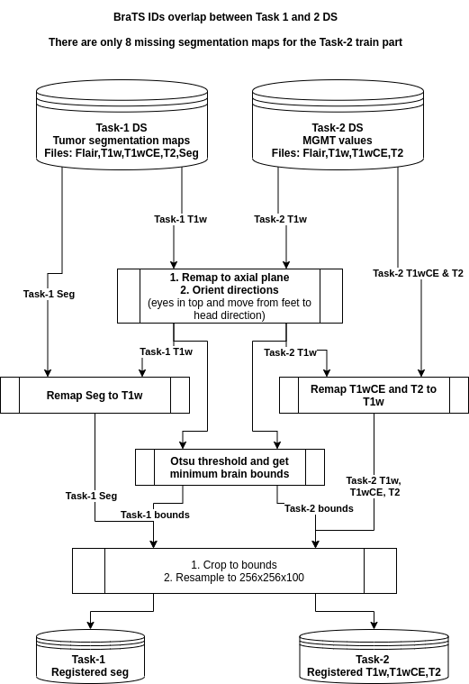

## RSNA-MICCAI Brain Tumor Radiogenomic Classification

Team Rähmä AI solution for [RSNA-MICCAI Brain Tumor Radiogenomic Classification 2021](https://www.kaggle.com/c/rsna-miccai-brain-tumor-radiogenomic-classification)

### Task
Predict the status of an MGMT promother methylation important for brain cancer treatment.


### Solution Overview
- Four provided MRI modalities and tumor segmentation masks were cropped to brain region and registered to aligned 3D RGB + 3D tumor masks.
- 3D Unet was trained to segment tumor. Pretrained weights were loaded from [2D MRI tumor segmentation model](https://github.com/mateuszbuda/brain-segmentation-pytorch).
- Linear models were trained to predict MGMT status from segmentation prediction radiomics features (shape, intensity stats, location)
- 2D CNN models were trained to predict MGMT status from tumor region T2W axial slices.
- Three linear segmentation feature models and 3 2D CNN models were ensembled to predict MGMT status. Ensemble was an average of Z-score normalized model predictions.

----------------------------------

#### Folder & file structure
```
root
|_input
|  |_rsna-miccai-brain-tumor-radiogenomic-classification
|    |_...
|
|media
|  |_...
|_notebooks
|  |_...
|_src
|  |_...
|
|_wandb_params.json
|_...
```

## Step descriptions

Most steps were done in Jupyter notebooks but CV-training scripts were also converted to python and shell scripts.

1. [cv-splits](./notebooks/1-cv-splits.ipynb) Split all train cohort BraTS21IDs into five folds stratified by MGMT_value.

2. [Case registration](./notebooks/2-case-registration.ipynb). Registers all MRI modalities to axial plane and saves patient cases as 100x256x256x3 (z,x,y,c) `BraTSID.npy` arrays (R:t1w, G:T1ce, B:T2). Additionally, registers [Task-1](https://www.synapse.org/#!Synapse:syn25829067/wiki/610863) segmentation masks to case and saves them as `BraTSID_seg.npy` 100x256x256 (z,x,y) arrays. This requires accepting Task-1 terms and downloading & extracting [this](https://www.kaggle.com/dschettler8845/load-task-1-dataset-comparison-w-task-2-dataset/data) set that @dschettler8845 uploaded. Here is a sample visualization of a registered case with tumor segmentation map.


3. [Registered DS sanity check](./notebooks/3-registered-ds-sanity-check.ipynb) Show how to open registered case files and check that everything looks right visually. Saves [tumor map videos](./media/registered-tumor-map.mp4) for visualization.

4. [Segmentation model](./notebooks/4-segmentation-model.ipynb). Training to segment tumor mask. Pretrained 2D MRI tumor segmentation model was used as base but converted to 3D. Pretrained 2D weights were also converted to 3D. A more recent version of this part has been converted to CV-training script `train_seg_folds.sh`.


5. [Extracting radiomics features from seg. masks](./notebooks/5.2-segmentation_features-256-noise-augs.ipynb) OOF tumor segmentation prediction features were collected. Features include shape, intensity statistics, glcm and location. Linear regression, LassoLarsIC, and Ridge regression models were trained with segmentation features. STD-Noise augmentatation was used and models reached ~0.63 AUC (5-fold CV averages) with < 0.01 STDs.


6. [2D single modality CNN](./notebooks/6-2D-axial-tumor-height-cnn.ipynb) Training 2D CNN models. Tumor prediction masks were used to select the axial slices from tumor region. Several slices were MIPed together (maximum intensity projection). A more recent version of this part has been converted to CV-training script `train_clf_folds.sh`.

7. [Ensembling seg. feature and CNN models](./notebooks/7-Ensemble.ipynb). OOF AUC reached 0.65.


8. [GradCAM visualization of MGMT areas](./notebooks/8-GradCAM.ipynb). Models seemed to highlight edges of brains and white regions in T2W modality. The visualization below is from resnet50 validation fold.


______________________________

## Environment setup for training

- Python 3.8
- Anaconda

Preferable way of setting up the development environment is with `conda`
```sh
conda create -n brainclf python=3.8 jupyter pip
conda activate brainclf
```

Install pytorch
```sh
conda install pytorch torchvision torchaudio cudatoolkit=11.0 -c pytorch
```

Install GDCM for reading some of the dicom formats
```sh
conda install -c conda-forge gdcm -y
```

Install python packages
```sh
pip install -r requirements.txt
```

## Preparing data - Registering modalities

See [notebook #2](./notebooks/2-case-registration.ipynb) for generating registered tumor segmentation annotations.

#### Registering process



```
from src.registering import Registered_BraTS_Case

dicom_dir = "./input/rsna-miccai-brain-tumor-radiogenomic-classification/test/"
resize_to=[256,256,100]
reg = Registered_BraTS_Case(dicom_dir, resize_to)

brat_id_str = "00709"

rgb_cube_arr = reg.get_registered_case(brat_id_str)
print(rgb_cube_arr.shape)
```
Prints:
`(100,256,256,3)`

## Training segmentation model

Before training, create a `wandb_params.json` file in root folder with wandb profile name.

Example file:
```
{
    "entity": "your_profile_name",
    "project": "raehmae-miccai-brainclf"
}
```

Train 5 fold models and one model with all training data:

`sh train_seg_folds.sh`

## Training 2D CNN model

Trains 5 fold models and one model with all training data.

`sh train_clf_folds.sh`

The parameters were chosen based on W&B parallel coordinates plot of different training parameters. Best models reached ~0.61 CV (5-fold) average with std of 0.05.

